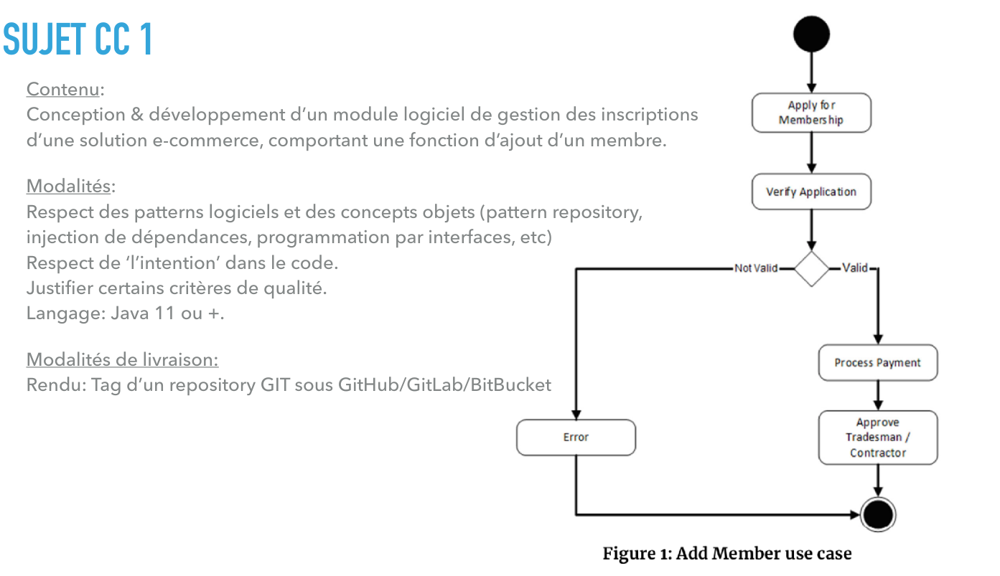

## [Lien github]((https://github.com/SwannHERRERA/CC1-AL-4))

[https://github.com/SwannHERRERA/CC1-AL-4](https://github.com/SwannHERRERA/CC1-AL-4)
[tag du rendu](https://github.com/SwannHERRERA/CC1-AL-4/releases/tag/rendu)
# Objectif du projet

Conception & développement d’un module logiciel de gestion des inscriptions  d’une solution e-commerce, 
comportant une fonction d’ajout d’un membre.

## Descriptif

- Respect des patterns logiciels et des concepts objets :
  - Pattern value Objectif
  - Pattern Entity
  - Pattern Repository
  - Pattern Strategy
  - Injection de dependance
- Favoriser une approche modulaire du code en gardant un maximum d'options le plus longtemps possible
- Favoriser le polymorphisme
- Respecter l'intention métier dans le code
- Utiliser des stubs / dummy
- Justifier certains critères de qualité si besoin

# Sujet




# Description de la solution proposée

## Fonctionnement

On a un user service qui reçoit une commande de création d'utilisateur.
Si l'utilisateur est créé alors on lance un événement qui est partagé à travers d'un bus d'événement.

Dans le fonctionnement actuel de l'application un "EnrollementListener" écoute cette évenement et qui va prendre de l'argent dans le compte de l'utilisateur, si l'utilisateur n'en a pas assez alors il prend le status refusé sinon il est validé.

## Choix d'implémentation

### Engine

J'ai décidé de passer par un engine, pour validé les utilisateurs. La vérification est faite au sein de user. Je 
déclenche une exception quand le user n'est pas valide.

>Un choix plus judicieux aurait probablement été de passer par un système de notification, car la construction de l'exception va être de plus en plus complexe au fur et à mesure que l'on rajoute des règles à la construction d'un user.

La vérification de l'email (unique) quant à elle ce fait au niveau du repository. Dans ce cas, l'entité User est correct, mais elle n'a pas sa place au sein de l'application.

### EventBus

Il y a deux événements possibles. 
- La création d'un utilisateur
- Le payement

Dans les deux cas, j'ai utilisé un système d'eventBus pour pouvoir écouté ces événements.


### Account

Les utilisateurs n'ont pas directement leur argent, pour cela on passe par un compte.

L'application a elle aussi un compte.

En faisant ce choix je decorèle le compte de l'utilisateur, c'est donc plus facile d'imaginer d'autre entité comme l'application avec un compte sans être des User, c'est aussi possible d'imaginé qu'un utilisateur pourrait avoir plusieurs compte.

### Money

Dans l'optique d'évité une "primitive obsession" j'ai utilisé la class Money pour wrapper les flux et montant financier.

Elle est fermée à une utilisation dans les nombres négatifs, Une exception dédiée à ces cas a été créé.

### Service et UseCase

Pour faire abstraction de la logique technique et me focaliser sur la logique métier. J'utilise un service (userService) qui va répondre a un cas d'utilisation (CreateUserUseCase).

### Repository

Pour gérer ma collection d'utilisateur, j'ai fais le choix d'utiliser le pattern repository pour plusieurs raisons :

- Le système de gestion de bases de données n'a pas encore été choisi
- J'ai une contrainte d'unicité sur l'utilisateur que je vois beaucoup plus au sein d'un répository que d'autres choses

### Command

J'ai fait le choix de structurer ma demande au service via une command, qui est traité dans le cas d'utilisation. Pour l'instant, je ne sais pas qu'elle structure va prendre la commande (REST API, graphql, CLI ...)

## Run the App

run all command in swannherrera folder

run test

```zsh
mvn test
```

Test report command

```zsh
mvn clean jacoco:prepare-agent install jacoco:report
```

Package and run the app

```zsh
mvn package exec:java
```